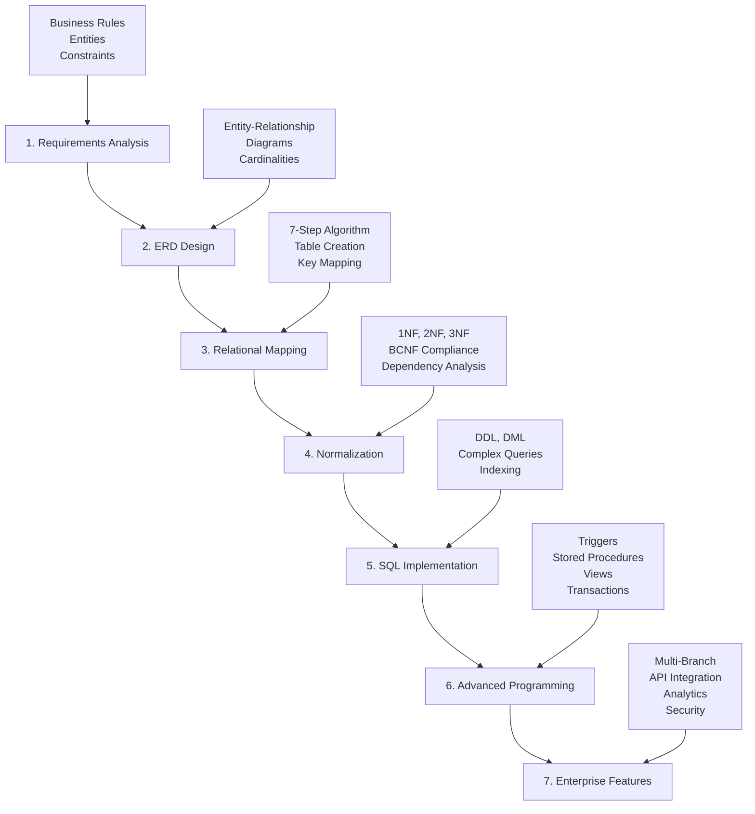

# 📚 Library Management System

[](https://www.microsoft.com/en-us/sql-server)
[](https://opensource.org/licenses/MIT)
[](https://github.com/DYBInh2k5/Library-Management-System/releases)
[](README.md)

> **Hệ thống Quản lý Thư viện Enterprise** - Dự án thực hành đầy đủ quy trình thiết kế và quản trị cơ sở dữ liệu từ lý thuyết đến thực thi, với các tính năng nâng cao cho thư viện hiện đại.

## ✨ Highlights

- 🎓 **Educational Project**: Minh họa đầy đủ 7 bước thiết kế CSDL chuyên nghiệp
- 🏢 **Enterprise Ready**: Hỗ trợ đa chi nhánh, phân quyền, API integration
- 📊 **Advanced Analytics**: AI-powered insights và real-time dashboard
- 🔐 **Security First**: Multi-layer security với audit logging
- 🚀 **Modern Architecture**: RESTful API, Webhook, Notification system
- 📱 **Scalable Design**: Thiết kế có thể mở rộng cho hàng triệu bản ghi

## 🏗️ Architecture

This project demonstrates the complete **Database Design Lifecycle**:



### Database Schema Overview
- **Core Tables**: Books, Members, Authors, Publishers, Categories
- **Relationship Tables**: Borrowing, Book-Author, Book-Category mappings
- **Enterprise Tables**: Reservations, Notifications, Branches, Users, Analytics
- **System Tables**: Audit logs, API logs, Configurations

## 📊 Project Statistics

| Component | Basic | Enterprise | Description |
|-----------|-------|------------|-------------|
| **Tables** | 8 | 20+ | Core + Enterprise features |
| **Stored Procedures** | 6 | 15+ | Business logic automation |
| **Views** | 9 | 12+ | Reporting and dashboards |
| **Triggers** | 5 | 8+ | Business rule enforcement |
| **API Endpoints** | 0 | 10+ | RESTful web services |
| **Security Features** | Basic | Advanced | RBAC, encryption, audit |

## 🎯 Features

### 📚 Core Library Management
- **Book Management**: ISBN tracking, multi-author support, categorization
- **Member Management**: Student/Faculty/Staff with different privileges  
- **Lending System**: Automated borrowing/returning with business rules
- **Fine Management**: Automatic late fee calculation (5,000 VND/day)
- **Inventory Tracking**: Real-time availability and stock management

### 🏢 Enterprise Features (v2.0+)
- **📋 Reservation System**: Book reservation when out of stock
- **🔔 Smart Notifications**: Email/SMS with customizable templates
- **🏢 Multi-Branch**: Manage multiple libraries with inter-branch transfers
- **📊 Advanced Analytics**: User behavior analysis and trend prediction
- **🔐 Security & RBAC**: Role-based access control with audit logging
- **🌐 API Integration**: RESTful endpoints and webhook system

### 🛠️ Technical Features
- **Database Design**: Fully normalized (BCNF) with 20+ tables
- **Stored Procedures**: 15+ procedures for complex business logic
- **Triggers**: Automated business rule enforcement
- **Views**: 12+ reporting and dashboard views
- **Transactions**: ACID-compliant multi-step operations
- **Performance**: Optimized queries with proper indexing

## 🚀 Quick Start

### Prerequisites
- SQL Server 2016+ (recommended 2019+)
- SQL Server Management Studio (SSMS)
- 4GB+ RAM, 10GB+ free disk space

### Installation

#### Option 1: Basic Version
```sql
-- Open SSMS and run:
:r "run-project.sql"
```

#### Option 2: Enterprise Version (Recommended)
```sql
-- Method 1: Automatic upgrade
-- Set @NangCapEnterprise = 1 in run-project.sql, then run it

-- Method 2: Manual upgrade
:r "run-project.sql"                              -- Basic installation
:r "7-advanced-features\run-advanced-features.sql" -- Enterprise upgrade
```

### Verification
```sql
USE QuanLyThuVien;

-- Basic version
SELECT * FROM V_DashboardTongQuan;

-- Enterprise version  
SELECT * FROM V_DashboardDieuHanh;
```

## 📖 Documentation

| Document | Description |
|----------|-------------|
| [📋 User Guide](user-guide.md) | Basic features and usage |
| [🚀 Advanced Guide](advanced-user-guide.md) | Enterprise features |
| [📊 Project Summary](project-summary.md) | Complete technical overview |
| [🔄 Changelog](CHANGELOG.md) | Version history |
| [🤝 Contributing](CONTRIBUTING.md) | How to contribute |## 🔧 Usa
ge Examples

### Basic Operations
```sql
-- Borrow a book
EXEC SP_MuonSach @MaThe = 'SV2024001', @ISBN = '978-0134685991', @SoNgayMuon = 30;

-- Return a book  
EXEC SP_TraSach @MaThe = 'SV2024001', @ISBN = '978-0134685991';

-- Search books
EXEC SP_TimKiemSach @TuKhoa = N'Java', @ChiLaySachConHang = 1;

-- Generate reports
EXEC SP_BaoCaoThongKe @LoaiBaoCao = N'SACH_DUOC_MUON_NHIEU';
```

### Enterprise Operations
```sql
-- Reserve a book
EXEC SP_DatTruocSach @MaThe = 'SV2024001', @ISBN = '978-0134685991';

-- Transfer books between branches
EXEC SP_ChuyenSachGiuaChiNhanh 
    @ChiNhanhNguon = 'CN001', @ChiNhanhDich = 'CN002', 
    @ISBN = '978-0134685991', @SoLuong = 2;

-- User authentication
EXEC SP_DangNhap @TenDangNhap = 'librarian1', @MatKhau = 'lib123';

-- API endpoint
EXEC SP_API_GetBookInfo @ISBN = '978-0134685991', @Format = 'JSON';
```

## 🎓 Educational Value

This project serves as a **comprehensive learning resource** for:

### Database Design & Theory
- **Requirements Analysis**: Business rule identification and entity modeling
- **ERD Design**: Entity-relationship diagrams with proper cardinalities
- **Normalization**: Step-by-step normalization to BCNF with dependency analysis
- **Relational Mapping**: 7-step algorithm from ERD to relational schema

### SQL Programming
- **DDL**: Table creation with constraints and relationships
- **DML**: Complex queries with joins, subqueries, and CTEs
- **Stored Procedures**: Business logic encapsulation with error handling
- **Triggers**: Automated business rule enforcement
- **Views**: Reporting and data abstraction layers
- **Transactions**: ACID compliance and concurrency control

### Enterprise Architecture
- **Multi-tier Design**: Separation of concerns and modularity
- **API Design**: RESTful services with proper HTTP methods
- **Security**: Authentication, authorization, and audit trails
- **Scalability**: Multi-branch architecture and performance optimization
- **Integration**: Webhook systems and external service integration

## 🤝 Contributing

We welcome contributions! Please see our [Contributing Guide](CONTRIBUTING.md) for details.

### Ways to Contribute
- 🐛 **Bug Reports**: Found an issue? Let us know!
- 💡 **Feature Requests**: Have ideas for improvements?
- 📝 **Documentation**: Help improve our docs
- 🔧 **Code**: Submit pull requests for fixes or features
- 🌍 **Translation**: Help translate to other languages

## 📄 License

This project is licensed under the MIT License - see the [LICENSE](LICENSE) file for details.

## 🙏 Acknowledgments

- **Educational Purpose**: Designed for database design learning
- **Industry Standards**: Follows SQL Server best practices
- **Community**: Built with feedback from developers and educators
- **Open Source**: Freely available for learning and modification

## 📞 Support

- 📧 **Email**: binh.vd01500@sinhvien.hoasen.edu.vn
- 💬 **Issues**: [GitHub Issues](https://github.com/DYBInh2k5/Library-Management-System/issues)
- 📖 **Wiki**: [Project Wiki](https://github.com/DYBInh2k5/Library-Management-System/wiki)
- 🌟 **Star**: If you find this project helpful, please give it a star!

---

<div align="center">

**Made with ❤️ for the Database Learning Community**

[⭐ Star this repo](https://github.com/DYBInh2k5/Library-Management-System) • [🐛 Report Bug](https://github.com/DYBInh2k5/Library-Management-System/issues) • [💡 Request Feature](https://github.com/DYBInh2k5/Library-Management-System/issues)

</div># Library-Management-System

